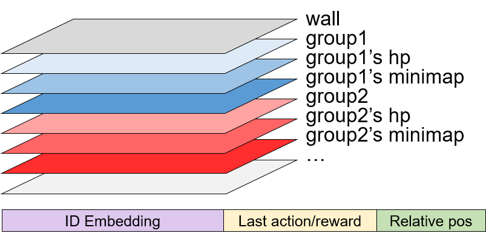
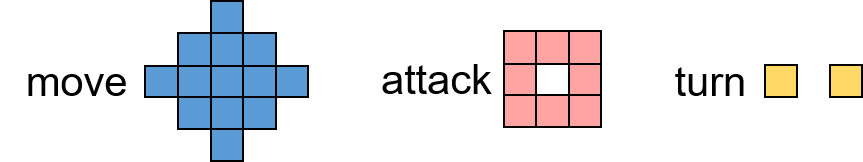

# Get started
This tutorial will tell you the basic setting of the gridworld in MAgent, and show how to run the first demo.

## Environment
The basic environment is a large gridworld. Agents and walls can be added in the world.

## Agents
Agents are controlled by groups. Agents in a group share the same general attributes and control method.
The attributes of an agent can be width, height, speed, hp, etc. An AgentType is registered as follows.
```python
predator = register_agent_type(
    "predator",
    {
        'width': 2, 'length': 2, 'hp': 1, 'speed': 1,
        'view_range': CircleRange(5), 'attack_range': CircleRange(2),
        'attack_penalty': -0.2
    })
```

## Observation
There are two parts in observation, spacial local view and non-spacial feature (see figure below).
- Spatial view consists of several rectangular channels. These channels will be masked by a circle or a sector. (see view_range above).
If the radius of a circle is 5, then the size of one channel is 11 x 11, where 11 = 5x2 + 1

- Non-spatial feature includes ID embedding, last action, last reward and normalized position.
ID embedding is the binary representation of agent's unique ID.



## Action
Actions are discrete actions. They can be move, attack and turn.
In the figure below, move range and attack range are also circular range (chunked to fit grids).
The center point is the body point of the agent. Each point in the figure is a valid action.
So if agent is configured as follow, it has 13 + 8 + 2 = 23 valid actions.




## Reward
Reward can be defined by constant attributes of agent type or by event trigger.
See [python/magent/builtin/config](../python/magent/builtin/config/) for more examples.
Of course, you can also write your own reward rules in the control logic in python code.

## Control & Model Parallelism
In Magent, agents are controled by groups. You should use group handle to manipulate agents.
A typical main loop of a game is listed as follows
```python
handles = env.get_handles()
while not done:
    # take actions for every model
    for i in range(n):
        obs[i] = env.get_observation(handles[i])
        ids[i] = env.get_agent_id(handles[i])
        # let models infer action in parallel (non-blocking)
        models[i].infer_action(obs[i], ids[i], 'e_greedy', eps, block=False)

    for i in range(n):
        acts[i] = models[i].fetch_action()  # fetch actions (blocking)
        env.set_action(handles[i], acts[i])
    
    done = env.step()
```
Also, you can train different groups in parallel. This means you can even deploy your models in different machines. (only several lines of modification in python, use socket instead of pipe).
```python
# train models in parallel
for i in range(n):
    models[i].train(print_every=1000, block=False)
for i in range(n):
    total_loss[i], value[i] = models[i].fetch_train()
```

## Run the first demo
Run the following command in the root directory, do not cd to `examples/`
```bash
export PYTHONPATH=$(pwd)/python:$PYTHONPATH
python examples/api_demo.py
```

In this environment, predators are pursuing preys. Predators can get rewards by attacking preys.
The predators and preys are trained by Deep Q-Network.
After training, predators learn to lock preys by cooperating with each other.  
See the source file [api_demo.py](../examples/api_demo.py) to know the basic api and workload of MAgent.
See also [train_pursuit.py](../examples/train_pursuit.py) to know how the above agents are trained.

## Watch video
* Go to directory `build/render`
* Execute `./render`
* Open index.html in browser. A modal will be opened once the frontend gets connected to the backend
* Type `config.json` and `video_1.txt` in the two input boxes.
* In the render, press arrow keys 'up', 'down', 'left', 'right' to move scope window. Press '<', '>' to zoom in or zoom out. For more help, press 'h'

## Play general-soldier game
In this section, Pygame are required.  
**Note for OSX user**: Unluckily, there is something wrong with Pygame on OSX, which makes this game very slow. You can skip this game if you are on OSX.

```base
pip install pygame
python examples/show_battle_game.py
```
In this game, you will act as a general and dispatch your soilders.
You have 10 chances to place your soilders in the map.
Then the soilders will act according to their deep q-networks.
You goal is to find best places to place your soilders and let them to eliminate the enemies.

## Next step
Try other examples and have fun!
